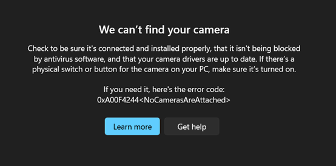
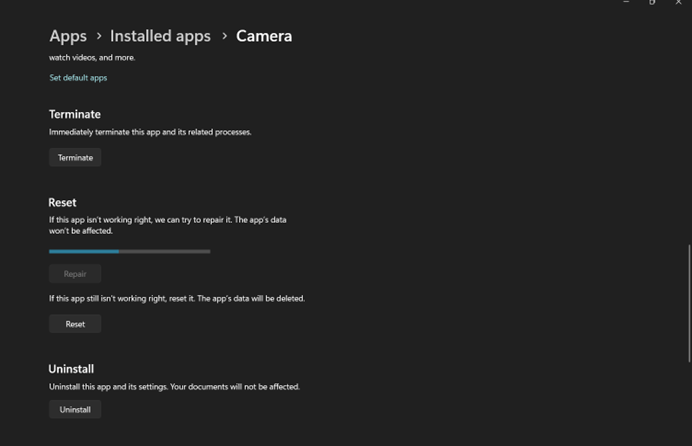

# 📷 Camera Troubleshooting Case Study

---

## ❗ Problem

Camera failed to work and showed:
> "Can't find the camera"

---

## 🔧 Troubleshooting Process

### 1. Checked Privacy Settings
Path:
Settings → Privacy & Security → Camera  

- Verified camera permissions were enabled  
- Result: ❌ Issue not resolved  

---

### 2. Checked Device Manager
- Camera was listed in Device Manager  
- Device appeared to be installed correctly  

- Result: ❌ System still could not detect camera  

---

### 3. Attempted to Update Driver
- Updated camera driver  

- Result: ❌ No change  

---

### 4. Restarted Camera Device
- Disabled and re-enabled camera  
- Restarted laptop  

- Result: ❌ Issue not resolved  

---

### 5. Reinstalled Camera Driver
- Uninstalled and reinstalled camera driver  

- Result: ❌ Issue persisted  

---

### 6. Attempted System Repair and Reset
- Performed repair and reset  

- Result: ❌ No improvement
  

---

### 7. Rolled Back Driver ✅ (Successful Fix)
- Reverted to previous driver version  

- Result: ✅ Camera working again  

---

## 📊 Final Result

- Root cause: **Driver update caused camera failure**  
- Solution: **Rolling back to previous driver restored functionality**

---

- Driver and device management  
- Root cause analysis  
- Technical documentation  
